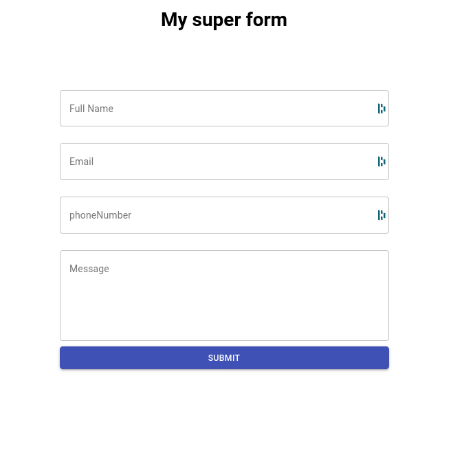

# 😎 Beautiful & Secure Contact-Form 📬

Using React, Material ui, React Hook Form and Yup.
>
My classy, responsive and secure contact-form handle's input validation for proper data format.

 
>


# Validations
✔️ Name 
>
✔️ Email
>
✔️ Phone number
>
✔️ User Message


## Run project
```bash
yarn install 
yarn start
```

## Isn't it lovely ? 



## Sources 

- <a href="https://react-hook-form.com/"> React Hook Form
- <a href="https://github.com/jquense/yup"> Yup </a>
- <a href="https://material-ui.com/"> Material Ui
